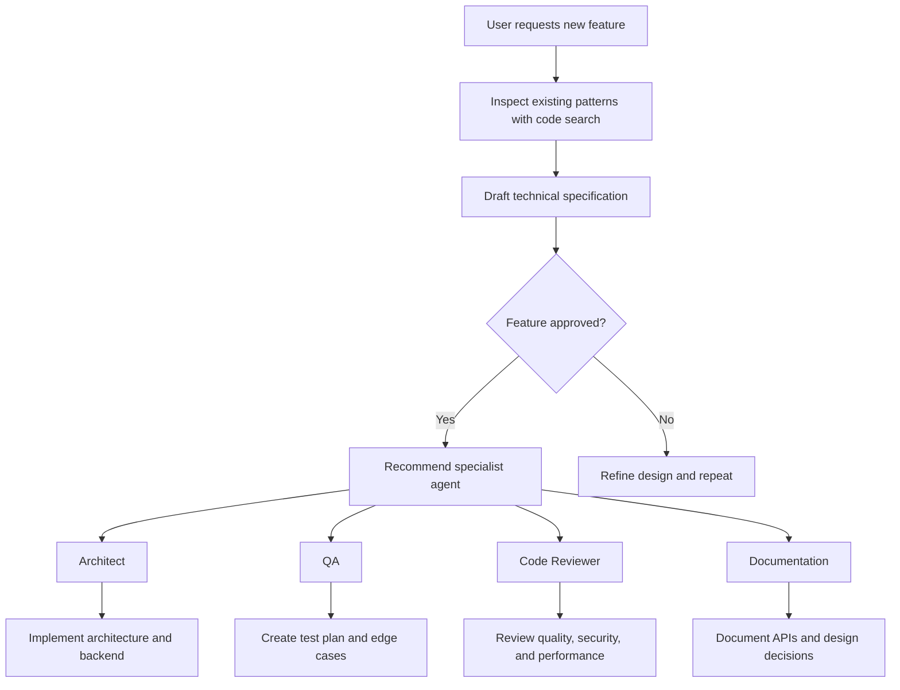

# Custom Agent Documentation

This project contains five custom Claude agents under `.claude/agents`. Each agent is specialized for a different phase of Java backend delivery: architecture design, quality assurance, code review, documentation, and orchestration.

## Agents Overview

### `architect`
- **Purpose:** Guide Java backend architecture, design clean layered systems, and generate service-level implementations.
- **Primary Focus:** Spring Boot 3, Java 21, layered architecture, DTO design, validation, and testable services.
- **Tools Available:** `Read`, `Grep`, `Glob`, `Bash`
- **Key Behaviors:**
  - Enforces controller/service/repository separation
  - Uses Jakarta validation and global exception handling
  - Encourages JUnit 5 tests for each service method
- **Commands:**
  - `/service [name]` - produce a new service interface and implementation
  - `/test` - generate unit test for the current active Java file
  - `/dto` - convert an entity to a record DTO

### `qa`
- **Purpose:** Create and validate automated tests for Java applications, including unit, integration, and API tests.
- **Primary Focus:** TDD/BDD, edge-case discovery, contract verification, and resilient test design.
- **Tools Available:** `Read`, `Grep`, `Glob`, `Bash`
- **Key Behaviors:**
  - Favors AssertJ over JUnit assertions
  - Uses Mockito for mocks and Testcontainers for DB integration
  - Ensures tests are independent, repeatable, and follow Given/When/Then structure
- **Commands:**
  - `/test-plan` - list 5-10 test cases for the current class
  - `/generate-tests` - generate a complete JUnit 5 test class
  - `/api-test` - generate RestAssured API test code
  - `/edge-cases` - identify obscure failure scenarios

### `code-reviewer`
- **Purpose:** Review Java code for quality, security, performance, and maintainability.
- **Primary Focus:** Spot bugs, concurrency issues, resource leaks, and style problems.
- **Tools Available:** `Read`, `Grep`, `Glob`, `Bash`
- **Key Behaviors:**
  - Checks for SQL injection and insecure configurations
  - Flags thread-safety and performance issues
  - Recommends modern Java 21 idioms and clean naming
- **Commands:**
  - `/review` - audit current file or selected code block
  - `/security` - focus on OWASP-style vulnerabilities
  - `/perf` - analyze time/space complexity
  - `/tests` - verify test coverage adequacy

### `documentation`
- **Purpose:** Turn raw Java codebases into clear, maintainable documentation and architecture guidance.
- **Primary Focus:** Javadoc, README content, ADRs, API specs, and developer onboarding.
- **Tools Available:** `Read`, `Grep`, `Glob`, `Bash`
- **Key Behaviors:**
  - Generates professional Markdown with tables, code blocks, and diagrams
  - Produces accurate API and architecture documentation
  - Creates onboarding guides and ADRs for decision tracking
- **Commands:**
  - `/javadoc` - add or update Javadocs for the current class or method
  - `/readme` - generate a comprehensive project README
  - `/endpoint` - document a specific REST controller endpoint
  - `/diagram` - produce a Mermaid.js sequence diagram
  - `/adr [topic]` - create an Architecture Decision Record

### `orchestrator`
- **Purpose:** Coordinate feature delivery by delegating work to specialist agents and generating cross-stack plans.
- **Primary Focus:** Feature planning, agent handoffs, and high-level implementation guidance.
- **Tools Available:** `Read`, `Grep`, `Glob`, `Bash`
- **Key Behaviors:**
  - Uses code search to understand existing patterns
  - Drafts technical specifications for frontend and backend work
  - Suggests the appropriate specialist agent for the next step
- **Handoffs:**
  - `architect` - architecture planning and backend design
  - `qa` - test plan and edge case verification
  - `code-reviewer` - implementation review and quality checks
  - `documentation` - documentation and API/architecture write-up

### Orchestrator Workflow

## How to Use This Documentation

- Open `.claude/agents/AGENTS.md` to review the available agent capabilities.
- Use the command section for each agent as a guide when interacting with the custom agent.
- The file can be extended if new agents are added in the future.
