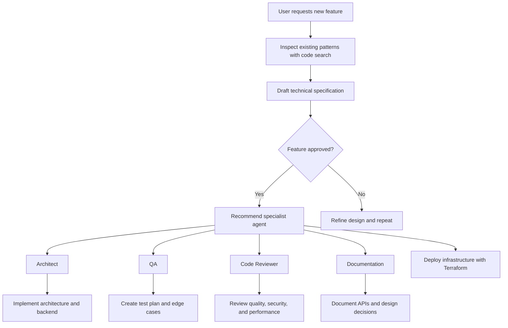

# fullstack-agent

This repository contains custom GitHub Copilot agents for Java backend delivery.

## Repository Structure

- `.claude/agents/architect.agent.md` — Java backend architecture agent.
- `.claude/agents/qa.agent.md` — QA automation and test planning agent.
- `.claude/agents/code-reviewer.agent.md` — code review and security/performance agent.
- `.claude/agents/documentation.agent.md` — documentation and architecture writing agent.
- `.claude/agents/terraform.agent.md` — AWS Terraform deployment agent for infrastructure provisioning.
- `.claude/agents/orchestrator.agent.md` — feature orchestration and specialist handoff agent.
- `.claude/agents/AGENTS.md` — consolidated agent documentation and usage guide.
- `.claude/skills/` — custom skill definitions for reusable capabilities.
- `.claude/instructions/` — shared instruction templates and agent behavior guidance.

## How to Use

- Open `.claude/agents/AGENTS.md` for a summary of each agent and supported commands.
- Edit the individual `.agent.md` files to adjust metadata, tools, or prompt behavior.
- Use `.claude/agents/terraform.agent.md` to manage AWS/Terraform deployment guidance and infrastructure workflows.

## Orchestrator Workflow

## Notes

- Agent definitions should remain under `.claude/agents/` for compatibility with the Copilot custom agent workflow.
- Keep root-level documentation focused on repository purpose and structure.
